# 🎬 Consultas SQL - Base de Dados de Filmes

Este repositório contém diversas consultas SQL para explorar dados de uma base com informações sobre filmes, atores e gêneros, como parte do curso de End to End Engineering da DIO -  WEX. 
Todas as consultas estão agrupadas e descritas a seguir:

---
<h1>📌 Índice & Imagens</h1>

- [🎞️ Filmes](#filmes)
  - <h3><a href="Imagens/SQL1.png">1. Nome e ano dos filmes</a></h3>  
    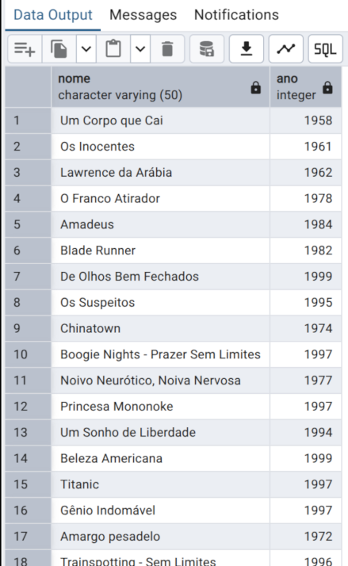
  - <h3><a href="Imagens/SQL2.png">2. Nome, ano e duração (ordenados por ano)</a></h3>  
    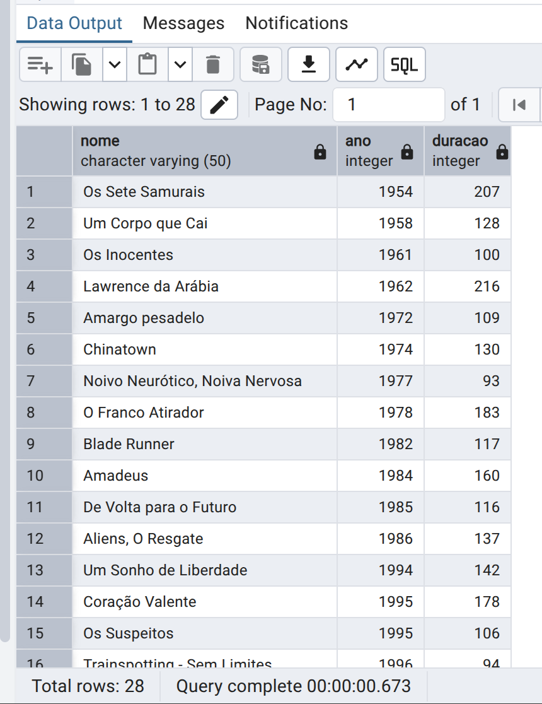
  - <h3><a href="Imagens/SQL3.png">3. Buscar o filme "De Volta para o Futuro"</a></h3>  
    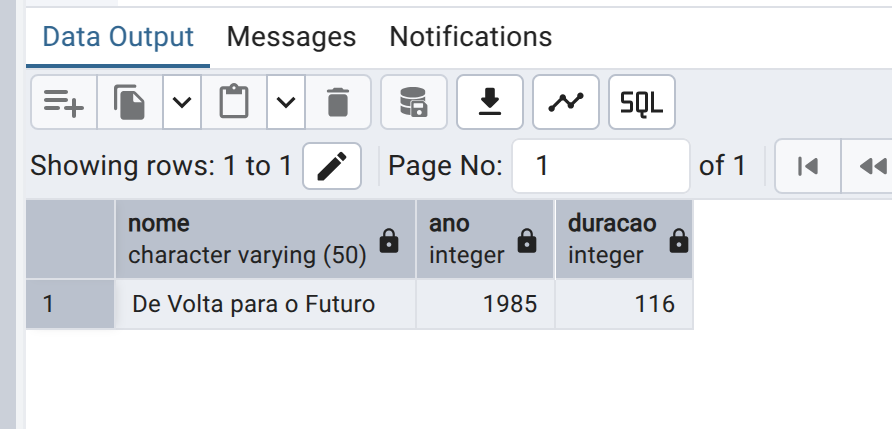
  - <h3><a href="Imagens/SQL4.png">4. Filmes lançados em 1997</a></h3>  
    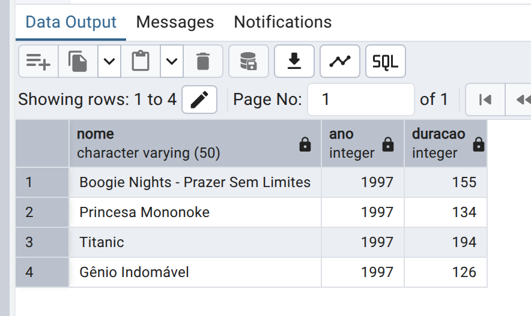
  - <h3><a href="Imagens/SQL5.png">5. Filmes lançados após o ano 2000</a></h3>  
    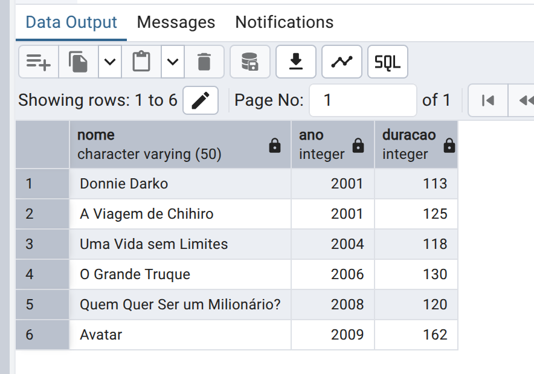
  - <h3><a href="Imagens/SQL6.png">6. Filmes com duração entre 100 e 150 minutos</a></h3>  
    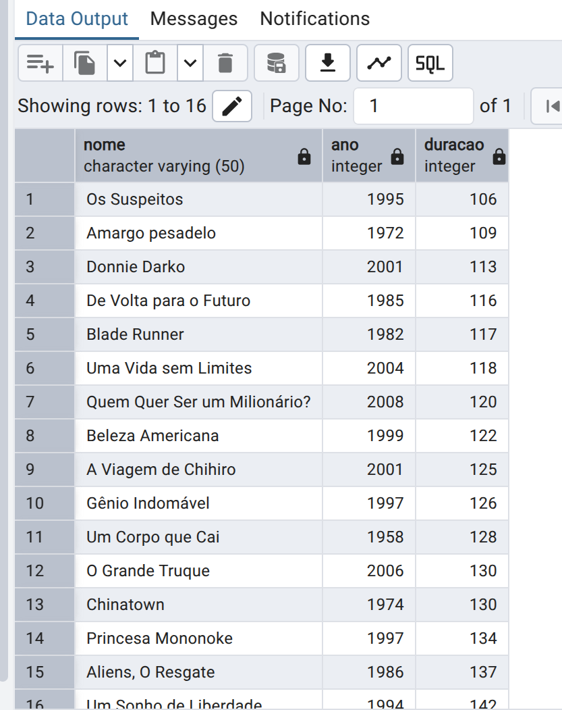
  - <h3><a href="Imagens/SQL7.png">7. Quantidade de filmes lançados por ano</a></h3>  
    

- [🧑‍🎤 Atores](#atores)
  - <h3><a href="Imagens/SQL8.png">8. Atores do gênero masculino</a></h3>  
    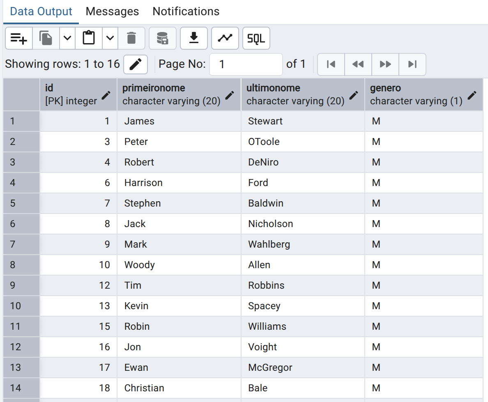
  - <h3><a href="Imagens/SQL9.png">9. Atores do gênero feminino (ordenados)</a></h3>  
    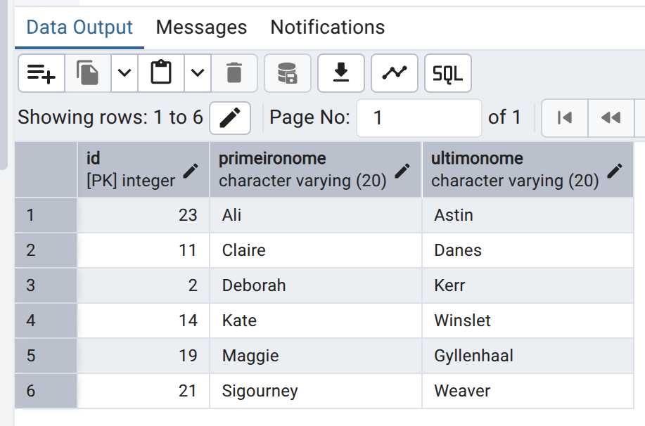

- [🏷️ Gêneros e Elenco](#gêneros-e-elenco)
  - <h3><a href="Imagens/SQL10.png">10. Nome do filme e seu gênero</a></h3>  
    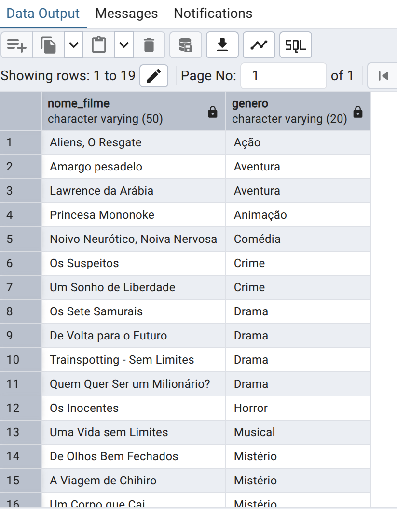
  - <h3><a href="Imagens/SQL11.png">11. Filmes do gênero "Mistério"</a></h3>  
    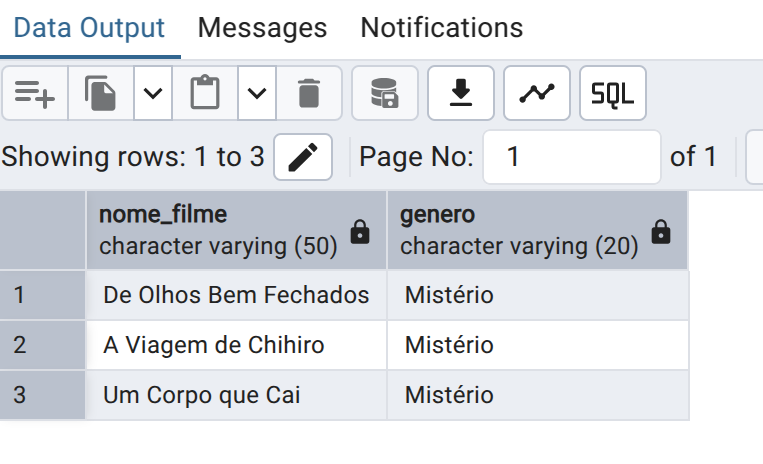
  - <h3><a href="Imagens/SQL12.png">12. Nome do filme e os atores com seus papéis</a></h3>  
    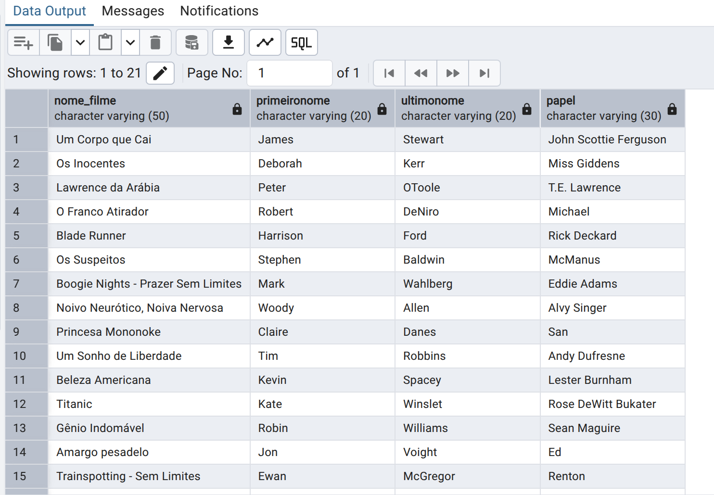
---

